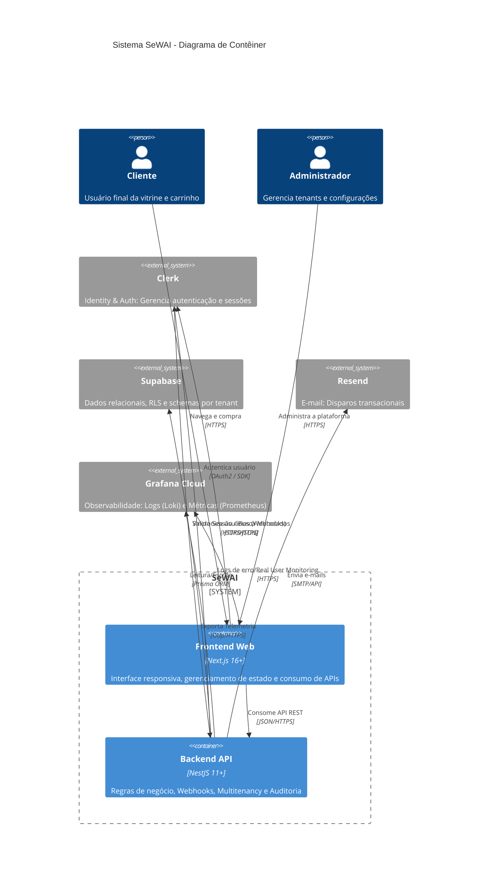

# C4 – Diagrama de Contêiner

```mermaid
C4Container
title Sistema SeWAI - Diagrama de Contêiner

Person(customer, "Cliente", "Usuário final da vitrine e carrinho")
Person(admin, "Administrador", "Gerencia tenants e configurações")

System_Boundary(sewai_boundary, "SeWAI") {
    Container(frontend, "Frontend Web", "Next.js 16+", "Interface responsiva, gerenciamento de estado e consumo de APIs")
    Container(backend, "Backend API", "NestJS 11+", "Regras de negócio, Webhooks, Multitenancy e Auditoria")        
}

System_Ext(clerk, "Clerk", "Identity & Auth: Gerencia autenticação e sessões")
System_Ext(supabase, "Supabase", "Dados relacionais, RLS e schemas por tenant")
System_Ext(resend, "Resend", "E-mail: Disparos transacionais")
System_Ext(grafana, "Grafana Cloud", "Observabilidade: Logs (Loki) e Métricas (Prometheus)")

%% Relações de Usuário
Rel(customer, frontend, "Navega e compra", "HTTPS")
Rel(admin, frontend, "Administra a plataforma", "HTTPS")

%% Fluxo de Autenticação (Ajustado)
Rel(frontend, clerk, "Autentica usuário", "OAuth2 / SDK")
Rel(backend, clerk, "Valida Sessão / Busca Metadados", "SDK/HTTPS")
Rel(clerk, backend, "Sincroniza usuários (Webhooks)", "HTTPS/JSON")

%% Fluxo de Dados Interno
Rel(frontend, backend, "Consome API REST", "JSON/HTTPS")
Rel(backend, supabase, "Leitura/Escrita", "Prisma ORM")

%% Integrações Externas
Rel(backend, resend, "Envia e-mails", "SMTP/API")
Rel(backend, grafana, "Exporta Telemetria", "Otlp/HTTPS")
Rel(frontend, grafana, "Logs de erro/Real User Monitoring", "HTTPS")

```
