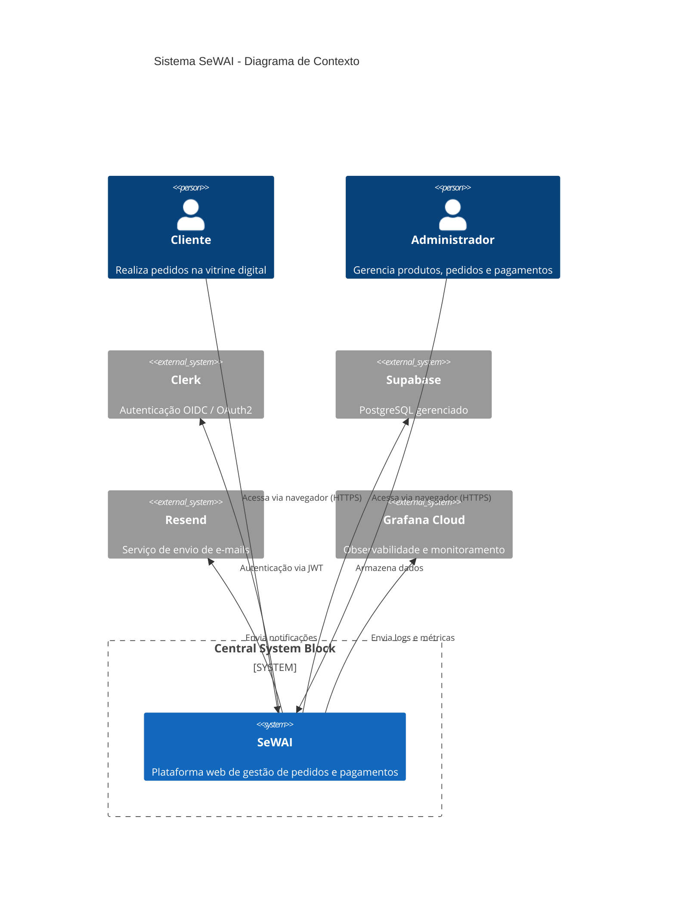

# C4 – Diagrama de Contexto  

```mermaid
C4Context
title Sistema SeWAI - Diagrama de Contexto

Person(customer, "Cliente", "Realiza pedidos na vitrine digital")
Rel(customer, sewai, "Acessa via navegador (HTTPS)")

Person(admin, "Administrador", "Gerencia produtos, pedidos e pagamentos")
Rel(admin, sewai, "Acessa via navegador (HTTPS)")
System_Boundary(b1, "Central System Block") {
    System(sewai, "SeWAI", "Plataforma web de gestão de pedidos e pagamentos")
}
System_Ext(clerk, "Clerk", "Autenticação OIDC / OAuth2")
Rel(sewai, clerk, "Autenticação via JWT")
System_Ext(supabase, "Supabase", "PostgreSQL gerenciado")
System_Ext(resend, "Resend", "Serviço de envio de e-mails")
System_Ext(grafana, "Grafana Cloud", "Observabilidade e monitoramento")

Rel(sewai, supabase, "Armazena dados")
Rel(sewai, resend, "Envia notificações")
Rel(sewai, grafana, "Envia logs e métricas")

```
