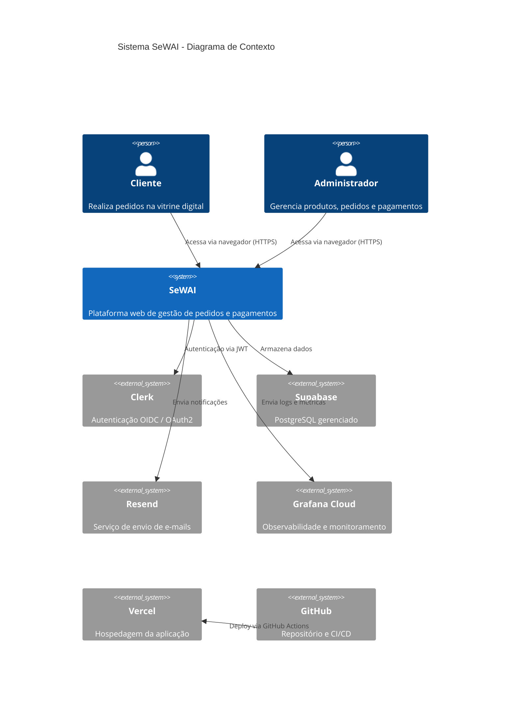

# C4 – Diagrama de Contexto  

Sistema: SeWAI

```mermaid
C4Context
    title Sistema SeWAI - Diagrama de Contexto

    Person(customer, "Cliente", "Realiza pedidos na vitrine digital")
    Person(admin, "Administrador", "Gerencia produtos, pedidos e pagamentos")

    System(sewai, "SeWAI", "Plataforma web de gestão de pedidos e pagamentos")

    System_Ext(clerk, "Clerk", "Autenticação OIDC / OAuth2")
    System_Ext(supabase, "Supabase", "PostgreSQL gerenciado")
    System_Ext(resend, "Resend", "Serviço de envio de e-mails")
    System_Ext(grafana, "Grafana Cloud", "Observabilidade e monitoramento")
    System_Ext(vercel, "Vercel", "Hospedagem da aplicação")
    System_Ext(github, "GitHub", "Repositório e CI/CD")

    Rel(customer, sewai, "Acessa via navegador (HTTPS)")
    Rel(admin, sewai, "Acessa via navegador (HTTPS)")

    Rel(sewai, clerk, "Autenticação via JWT")
    Rel(sewai, supabase, "Armazena dados")
    Rel(sewai, resend, "Envia notificações")
    Rel(sewai, grafana, "Envia logs e métricas")
    Rel(github, vercel, "Deploy via GitHub Actions")
```
