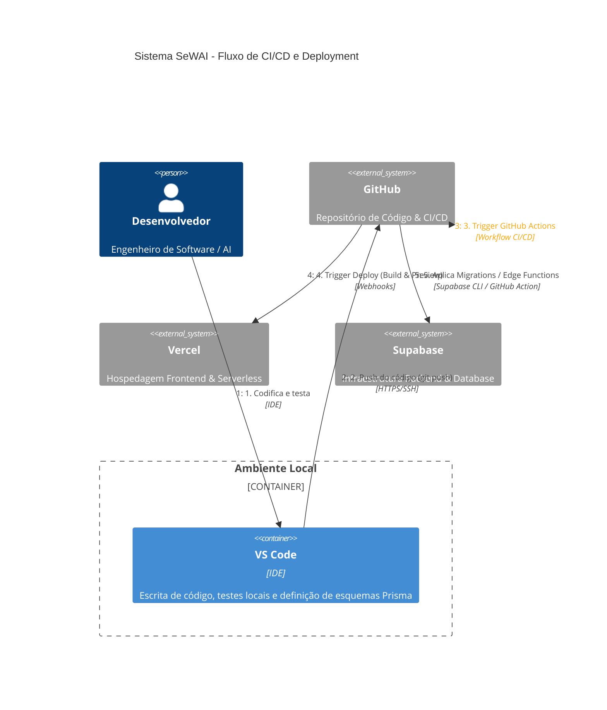

# C4 – Diagrama de Pipeline e CI/CD

```mermaid
C4Dynamic
    title Sistema SeWAI - Fluxo de CI/CD e Deployment

    Person(developer, "Desenvolvedor", "Engenheiro de Software / AI")
    
    Container_Boundary(local_env, "Ambiente Local") {
        Container(vscode, "VS Code", "IDE", "Escrita de código, testes locais e definição de esquemas Prisma")
    }

    System_Ext(github, "GitHub", "Repositório de Código & CI/CD")
    System_Ext(vercel, "Vercel", "Hospedagem Frontend & Serverless")
    System_Ext(supabase, "Supabase", "Infraestrutura Backend & Database")

    Rel(developer, vscode, "1. Codifica e testa", "IDE")
    Rel(vscode, github, "2. Push do código (git push)", "HTTPS/SSH")
    
    Rel(github, github, "3. Trigger GitHub Actions", "Workflow CI/CD")
    
    Rel(github, vercel, "4. Trigger Deploy (Build & Preview)", "Webhooks")
    Rel(github, supabase, "5. Aplica Migrations / Edge Functions", "Supabase CLI / GitHub Action")

    UpdateElementStyle(developer, $fontColor="white", $bgColor="#08427b")
    UpdateRelStyle(github, github, $textColor="orange", $lineColor="orange")
```
