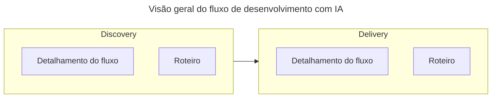

# Roteiro para desenvolvimento de software com IA

Os objetivos são:
- Clareza de escopo,
- Redução de ambiguidade,
- Consistência entre requisitos, design e implementação,
- Uso eficiente de modelos de IA como copilotos de desenvolvimento.

Pré-requisitos:
- Google Antigravity <https://antigravity.google> instalado localmente.
- Node.js <https://nodejs.org/> instalado localmente.
- Git <https://git-scm.com/> instalado localmente.
- Conta GitHub <https://github.com/>.
- Conta Vercel <https://vercel.com/>.
- Conta Clerk <https://www.clerk.com/>.
- Conta Supabase <https://www.supabase.com/>.
- Conta Grafana Cloud <https://grafana.com/cloud/>.

Diretrizes gerais:
- Usar saída de cada atividade como contexto para atividade seguinte.
- Usar one shot injection.
- GitHub como single source of truth em todo fluxo.
- Markdown como "língua franca".
